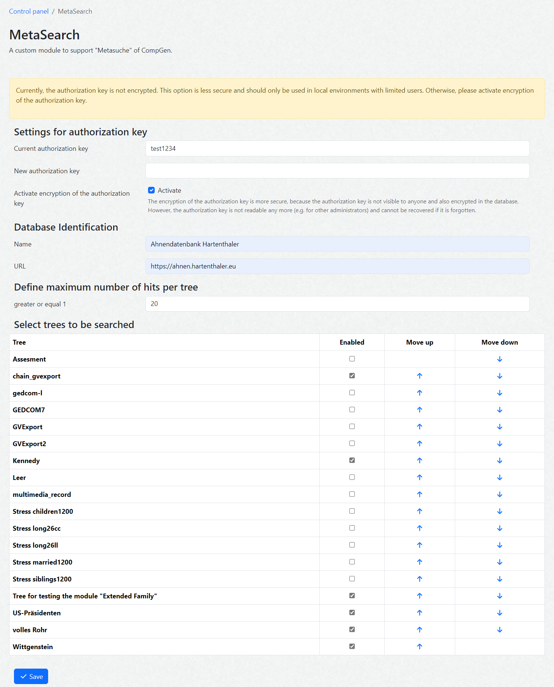

# webtrees module hh_metasearch 

This [webtrees](https://www.webtrees.net) custom module supports the CompGen "Metasuche" at [meta.genealogy.net](https://meta.genealogy.net/).

**This is an alpha version. Do not install in productive webtrees systems!**

## Contents

This Readme contains the following main sections

* [Description](#description)
* [Security Note](#security)
* [Usage and API](#usage)
* [Results](#results)
* [Requirements](#requirements)
* [Installation](#installation)
* [Module Settings](#settings)
* [Upgrade](#upgrade)
* [Translation](#translation)
* [Contact Support](#support)
* [License](#license)

## Description

+ Allow CompGen "[Metasuche](https://meta.genealogy.net/)" to search for data in one or more webtrees trees.
+ Only data which is publicly available will be found.
+ The result in JSON format is defined in the CompGen [GenWiki](https://wiki.genealogy.net/Metasuche/neue_Schnittstelle). 

## Security Note

An access key can be stored in the module preferences in webtrees. If such a key is defined access is only allowed if the provided key is used in the URL and is identical to the authorization key in the webtrees database (settings). 

**It is highly recommended to use the HTTPS protocol** (i.e. URLs with https://...) to encrypt the URL parameters, especially the authorization key.

## Usage and API

### URL Format
The full URL format, which contains all possible parameters is defined as follows:

https://DOMAIN/index.php?route=ROUTE&trees=TREE_LIST&key=KEY&lastname=NAME&placename=PLACE&placeid=GOV&since=YYYY-MM-DD

The placeholders need to be replaced by the specific parameter values. Some parameters are dynamically generated by "Metasuche". The possible values for the URL parameters are described below.

It is not mandatory to provide parameters (only URL and ROUTE are mandatory).

### Example URLs  
https://xyz.de/webtrees/index.php?route=/webtrees/MetaSearch&key=hYHBiZM9&lastname=Hartenthaler

https://webtrees.xyz.de/index.php?route=MetaSearch&trees=tree1,tree2&lastname=Baumgärtner&placeid=ENNACHJN48PB

***Wie sieht die URL bei Pretty-URL aus?***

### Values for URL Parameters
* DOMAIN is the domain name of the webtrees server.

* ROUTE is the route to use the MetaSearch service.
  * It can be for example "/webtrees/MetaSearch". Or it can be only "MetaSearch" if a subdomain is used.

* TREE_LIST specifies the list of webtrees tree names that are used to search (using the tree name, not the tree title). The entries are separated by ","; blanks are not allowed.
  * The default list of trees is specified by an administrator in the control panel of this module. This list is used if there is no TREE_LIST specified in the URL. If there is a TREE_LIST parameter, the predefined list is ignored.

* KEY specifies an authorization key, which restricts the access to search
  * If a key is not provided in the webtrees database, the search will be allowed (independent if a key is specified in the URL or not).
  * If a key is defined in the database, this key has to be used in the URL, otherwise, the result will be a JSON specifying this error.
  * The provided authorization key needs to have a minimum length of 8 characters.
  * **The control panel also provides an option for the authorization key to be saved as an encrypted hash value**. This option is more secure because the authorization key is not visible to anyone and is also encrypted in the database. However, the authorization key is not readable any more (even for administrators) and cannot be recovered if it is forgotten.

* NAME
  * Die hier angegebene Zeichenkette wird in den Nachnamen (GEDCOM-Kennzeichen SURN) in den Personendatensätzen (INDI) der selektierten Bäume gesucht (in allen NAME-Datensätzen einer Person). Adelstitel, wie "Baron", Namenspräfixe wie "von" oder Postfixe wie "jr." sollten nicht für die Suche verwendet werden. Doppelnamen, Umlaute und Sonderzeichen können verwendet werden, etwa bei "Maier-Lüdenscheid" oder "McKnight" oder "da Vinci". Die Klein-/Großschreibung ist irrelevant.

* PLACE
  * Eine hier angegebene Zeichenkette wird in den PLAC-Daten der Personendatensätze gesucht.
  * Die Suche erfolgt in der Form, wie diese Daten in der Datenbank angegeben worden sind. Wenn die Orte also in der Form "Ennetach, Mengen, Sigmaringen, Baden-Württenberg, DEU" in der Datenbank spezifiziert sind, dann wird eine Suche nach "Deutschland" keine Treffer liefern, eine Suche nach "Ennetach, Mengen" oder nach "DEU" aber sehr wohl. Wenn in der Datenbank historische Ortsnamen verwendet worden sind, etwa "Preußisch Eylau, Königsberg", dann wird eine Suche nach dem heutigen Namen "Bagrationowsk" keinen Treffer liefern; wenn umgekehrt der Name in der Datenbank mit "Bagrationowsk, Bagrationovskij rajon, Kaliningradskaja oblast, RUS" angegeben ist, wird eine Suche nach "Eylau" erfolglos bleiben.

* GOV
  * Der Parameter mit der GOV-ID kommt nur zum Tragen, wenn in der Metasuche ein Alert gesetzt worden ist; in der normalen Metasuche kann dieser Parameter nicht angegeben werden.
  * Dieses Modul geht davon aus, dass einem Ort (GEDCOM-Kennzeichen PLAC) ein gemeinsamer Ort zugewiesen wird (GEDCOM-Kennzeichen _LOC) und diesem gemeinsamen Ort eine GOV-ID (GEDCOM-Kennzeichen _GOV) zugeordnet ist. Eine direkte Zuordnung von _GOV zu einem PLAC wird nicht unterstützt.

* YYYY-MM-DD
  * Wenn der Parameter "since" in der Form yyyy-mm-dd angegeben ist, dann werden nur Ergebnisse zurück geliefert, deren letztes Änderungsdatum (CHAN) im Personendatensatz (INDI) definiert und neuer ist (bei gleichem Datumswert erfolgt keine Treffermeldung).

Die vier letzten Parameter aus der Metasuche sind optional; wenn lastname und placename und placeid fehlen (also alle drei Parameter), wird ein leeres Ergebnis für jeden tree zurückgegeben. Diese drei Parmeter sind mit "UND" verknüpft. Der optionale Parameter "since" ist, falls er bei einem Metasuche-Alert angegeben worden ist, immer mit "UND" verknüpft.

### Results ###
tbd: show JSON results 

## Requirements

This module requires **webtrees** version 2.1 or later.
This module has the same requirements as [webtrees#system-requirements](https://github.com/fisharebest/webtrees#system-requirements).

This module was developed and tested with [webtrees 2.1.18](https://webtrees.net/download),
but should also run with any other 2.1 version.
It was tested with all other custom modules.

## Installation

This section documents installation instructions for this module.

1. Download the [latest release](https://github.com/Hartenthaler/hh_metasearch/releases/latest) of the module
1. Unzip the package into your `webtrees/modules_v4` directory of your web server
1. Rename the folder to `hh_metasearch`
1. Login to **webtrees** as an administrator, go to Control Panel/Modules/Other, and find the module called `hh_metasearch`. Check if it has a tick for "Enabled".
1. Provide an authorization key in the module settings, see the [chapter below](#settings).
1. Specify in the module settings the trees which can be searched and other parameters.
1. Finally, click SAVE, to complete the installation.

## Module Settings

In the control panel, it is possible to provide default values for the list of searchable trees and the maximum number of delivered hits for each of the trees.
Additionally the name of the database and its URL can be defined.

## Upgrade

To update simply replace the `hh_metasearch` files
with the new ones from the latest release.

## Translation
You can help to translate this module.
The translation is based on [gettext](https://en.wikipedia.org/wiki/Gettext) and uses .po files,
which can be found in [/resources/lang/](https://github.com/Hartenthaler/hh_metasearch/tree/main/resources/lang).
You can use a local editor like [Poedit](https://poedit.net/) or notepad++ to work on translations
and provide them in the [GitHub repository](https://github.com/Hartenthaler/hh_metasearch) of the module.
You can do this via a pull request (if you know how to do it),
or by opening a new issue and attaching a .po file.
Updated translations will be included in the next release of this module.

Currently, the following languages are available
+ English
+ German

## Support

* Issues: you can report errors raising an issue in this GitHub repository.
* Feature requests: you can create an issue in this GitHub repository.
* Forum: general webtrees support can be found at the [webtrees forum](http://www.webtrees.net/).

## License

* Copyright (C) 2023 Hermann Hartenthaler
* Some elements of this module were originally developed by **Jefferson49** for the custom module [`DownloadGedcomWithURL`](https://github.com/Jefferson49/DownloadGedcomWithURL).
* Derived from **webtrees** - Copyright 2023 webtrees development team.

This program is free software: you can redistribute it and/or modify
it under the terms of the GNU General Public License as published by
the Free Software Foundation, either version 3 of the License, or
(at your option) any later version.

This program is distributed in the hope that it will be useful,
but WITHOUT ANY WARRANTY; without even the implied warranty of
MERCHANTABILITY or FITNESS FOR A PARTICULAR PURPOSE. See the
GNU General Public License for more details.

You should have received a copy of the GNU General Public License
along with this program. If not, see <http://www.gnu.org/licenses/>.

* * *